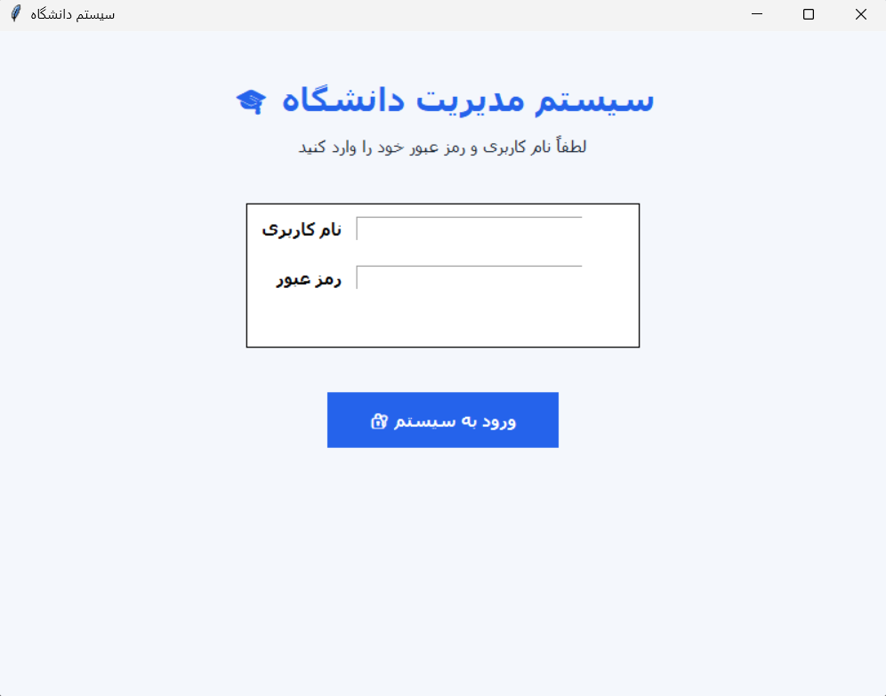
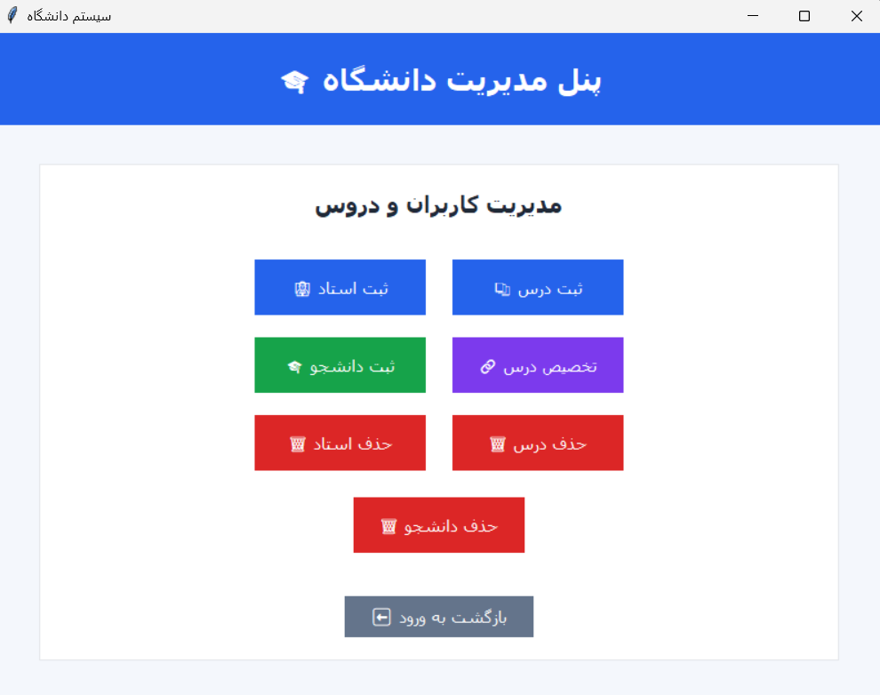
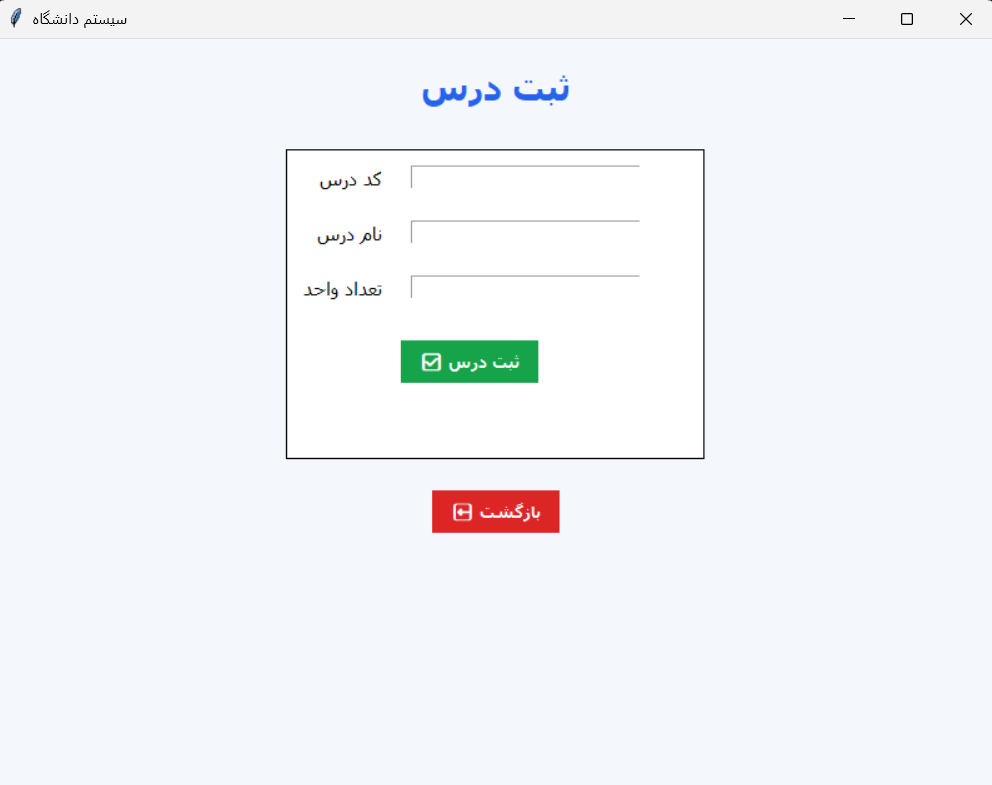
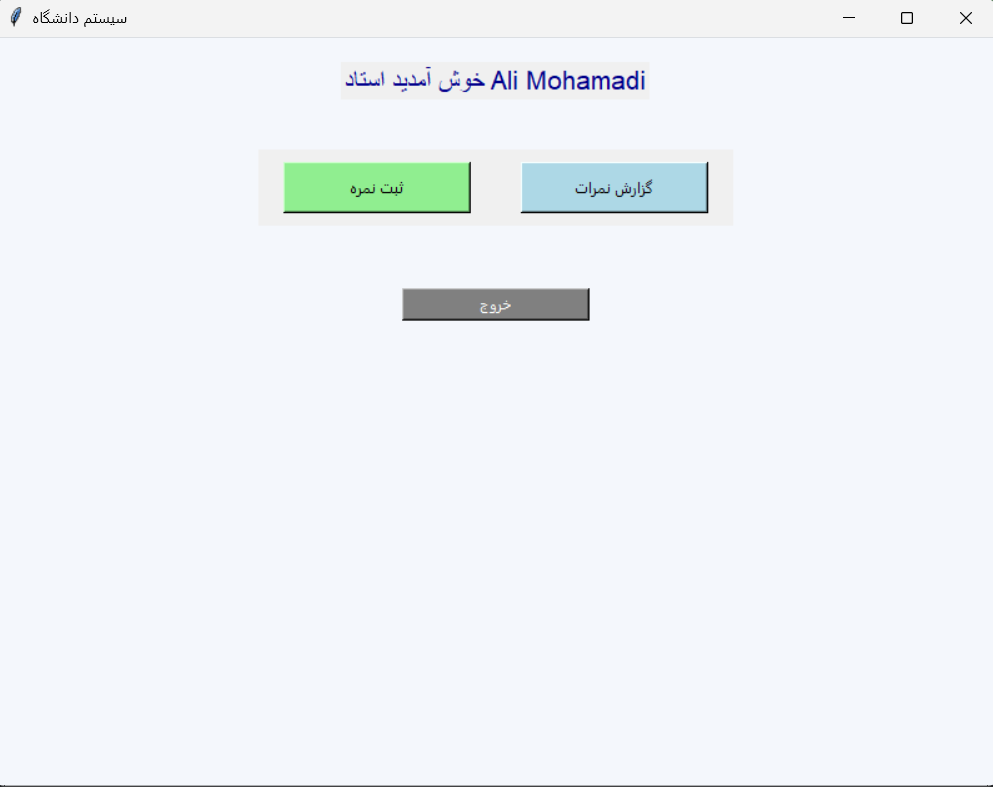
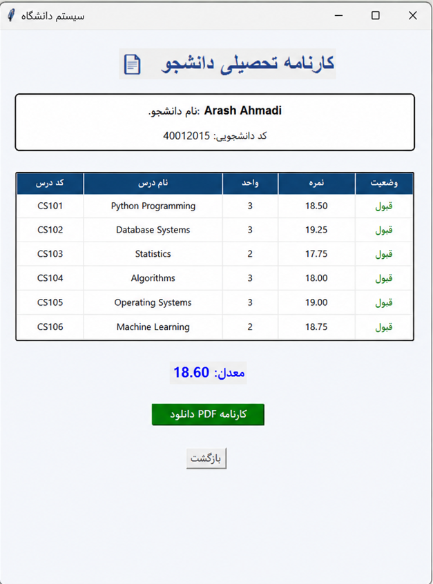
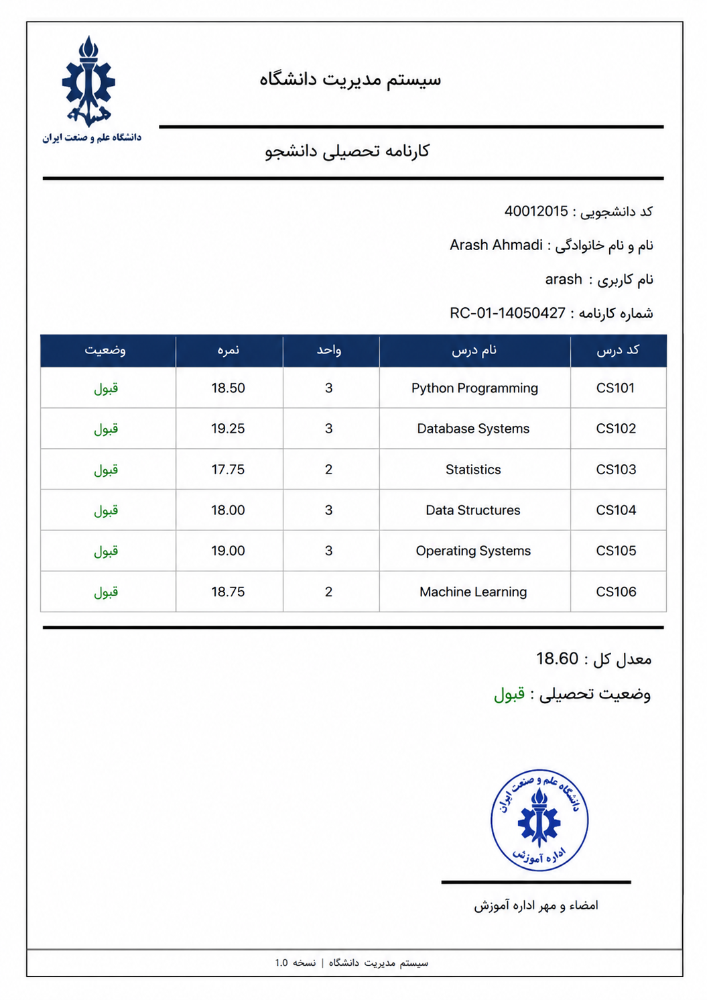

# 🎓 University Management System

A Python-based desktop application for managing university student information, courses, grades, and academic reports.

This project demonstrates practical implementation of **Python programming, GUI development, data management, and report generation** in an academic management environment.


---

# 📌 Project Overview

The **University Management System** is designed to simplify academic data management by providing an organized platform for handling:

- 👨‍🎓 Student information
- 📚 Course registration
- 📝 Grade management
- 📊 Academic reports
- 📄 PDF transcript generation


The application provides a user-friendly interface and stores academic data using structured JSON files.


---

# ✨ Features


## 🔐 Login System

- User authentication
- Secure access to the application


## 👨‍💼 Student Management

- Add student information
- Edit student records
- Search student data
- Manage academic profiles


## 📚 Course Registration

- Register courses for students
- Manage course information
- Track enrolled courses


## 📝 Grade Management

- Enter student grades
- Calculate academic results
- Monitor student performance


## 🎓 Report Card Generation

- Generate academic transcripts
- Display student performance
- Create printable reports


## 📄 PDF Export

- Generate PDF academic reports
- Professional formatted documents


---

# 🛠 Technologies Used


| Technology | Purpose |
|---|---|
| 🐍 Python | Core Programming Language |
| 🖥 Tkinter | Graphical User Interface |
| 📂 JSON | Data Storage Management |
| 📄 ReportLab | PDF Report Generation |
| 🧩 Object-Oriented Programming | Application Structure |


---

# 📸 Screenshots


## 🔐 Login

<p align="center">

</p>


---


## 👨‍💼 Admin Dashboard

<p align="center">

</p>


---


## 📚 Course Registration

<p align="center">

</p>


---


## 📝 Grade Management

<p align="center">

</p>


---


## 🎓 Student Report Card

<p align="center">

</p>


---


## 📄 PDF Academic Transcript

<p align="center">

</p>


---

# 🏗 Project Structure


```
Student-Management-System/
│
├── Assets/
│   └── university-management-system-banner.png
│
├── Fonts/
│
├── Screenshots/
│   ├── login.png
│   ├── admin-panel.png
│   ├── course-registration.png
│   ├── grade-management.png
│   ├── report-card.png
│   └── pdf-report.png
│
├── school_data.json
├── student_management_system.py
├── requirements.txt
├── LICENSE
└── README.md
```


---

# 🚀 Installation & Run


### 1. Clone the repository

```bash
git clone https://github.com/somayehforouzandeh/Student-Management-System.git
```


### 2. Install dependencies

```bash
pip install -r requirements.txt
```


### 3. Run the application

```bash
python student_management_system.py
```


---

# 🔮 Future Improvements

- 🔐 Authentication with encrypted passwords
- 🗄 SQLite / PostgreSQL database integration
- 👤 Student profile photos
- 📊 Dashboard and analytics
- 📈 Charts and GPA statistics
- 📤 Export reports to Excel
- 👥 Multi-user system
- 🌙 Dark Mode


---

# 🎯 Learning Outcomes

This project demonstrates practical implementation of:


✔ Object-Oriented Programming (OOP)  
✔ Tkinter GUI Development  
✔ JSON Data Management  
✔ PDF Generation using ReportLab  
✔ CRUD Operations  
✔ Academic Report Generation  
✔ Software Project Organization  


---

# 📜 License

This project is licensed under the MIT License.


---

# ⭐ If you like this project

Please consider giving this repository a ⭐ on GitHub.

Your feedback and suggestions are welcome.
